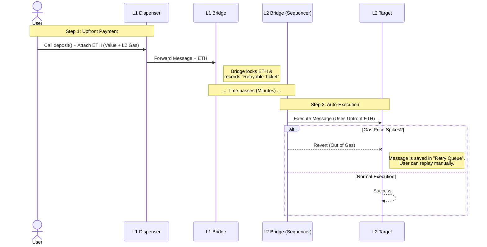
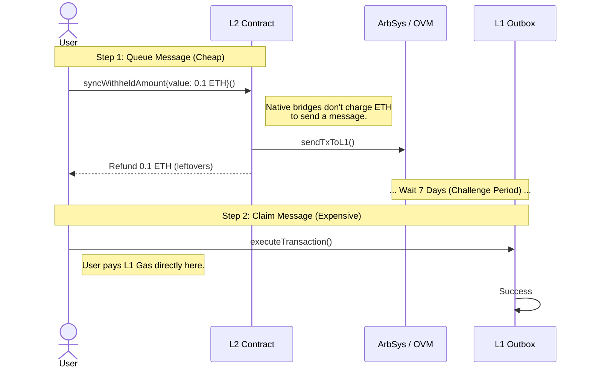
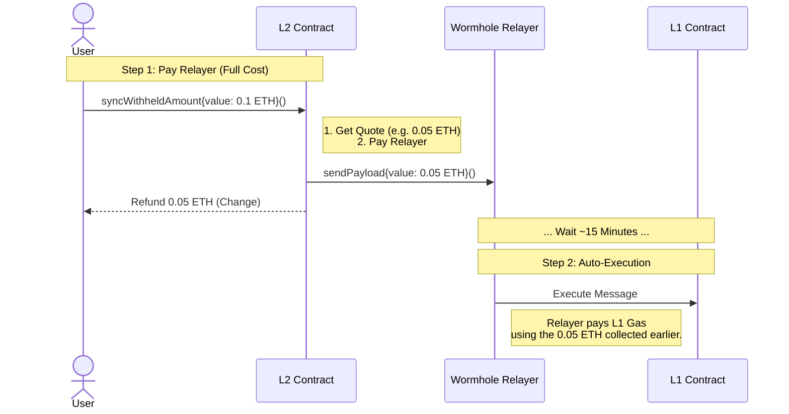

# Cross-Chain Gas & Fee Mechanics

Understanding how gas fees work across different chains is critical for secure bridge integration. This document breaks down the two primary models used in cross-chain communication: the **Push Model** (e.g., Wormhole) and the **Pull Model** (e.g., Optimism/Arbitrum).

## 1. The Core Concept: "Who Pays the Postman?"

Every cross-chain transaction involves two costs:

1. **Source Chain Gas:** The cost to send the message *out*.
2. **Destination Chain Gas:** The cost to execute the message *in*.

The major difference between bridges is **when** and **who** pays for the Destination Chain Gas.

---

## 2. L1 $\to$ L2 (Deposits)

**Model:** Push (Pay Upfront)

When sending funds or data from Ethereum (L1) to a Layer 2 (L2), the user pays for everything upfront. The L1 Bridge calculates the estimated cost of the L2 transaction and charges the user immediately.

### Flow Diagram

### Key Takeaways

* **User Pays:** L1 Transaction Fee + L2 Execution Fee (bundled in `msg.value`).
* **Safety Net:** If gas prices spike on L2 and the transaction fails, the message is **not lost**. It sits in a "Retry Queue" on L2, where the user can manually provide more gas to push it through.

---

## 3. L2  L1 (Withdrawals / Sync)

This direction varies significantly depending on the bridge architecture.

### Scenario A: Native Rollups (Arbitrum, Optimism)

**Model:** Pull (Pay Later / Collect-on-Delivery)

These bridges do **not** automatically execute the transaction on L1. They simply "post" the message to L1. The user (or a bot) must claim it later.

* **L2 Fee:** Cheap. Just recording the message.
* **L1 Fee:** Expensive. Paid by the user 7 days later.

### Scenario B: Generic Bridges (Wormhole, LayerZero)

**Model:** Push (Pay Upfront / FedEx)

These bridges use third-party "Relayers" to execute the transaction on the destination chain for you. You must pay the Relayer upfront on the source chain.

---

## 4. Summary Table

| Feature | **Native Rollups (Arb/Op)** | **Generic Bridges (Wormhole)** |
| --- | --- | --- |
| **Direction** | L2  L1 | L2  L1 (or L2  L2) |
| **Model** | **Pull** (Manual Claim) | **Push** (Auto Delivery) |
| **Who executes?** | **You** (User/Keeper) | **Relayer** (3rd Party) |
| **When do you pay?** | **Later** (on L1) | **Now** (on L2) |
| **`msg.value` Logic** | `leftovers = msg.value` (Full Refund) | `leftovers = msg.value - cost` |
| **Gas Risk** | You control the gas limit when you claim. | Requires `Min/Max Gas` checks to protect Relayer. |

---
